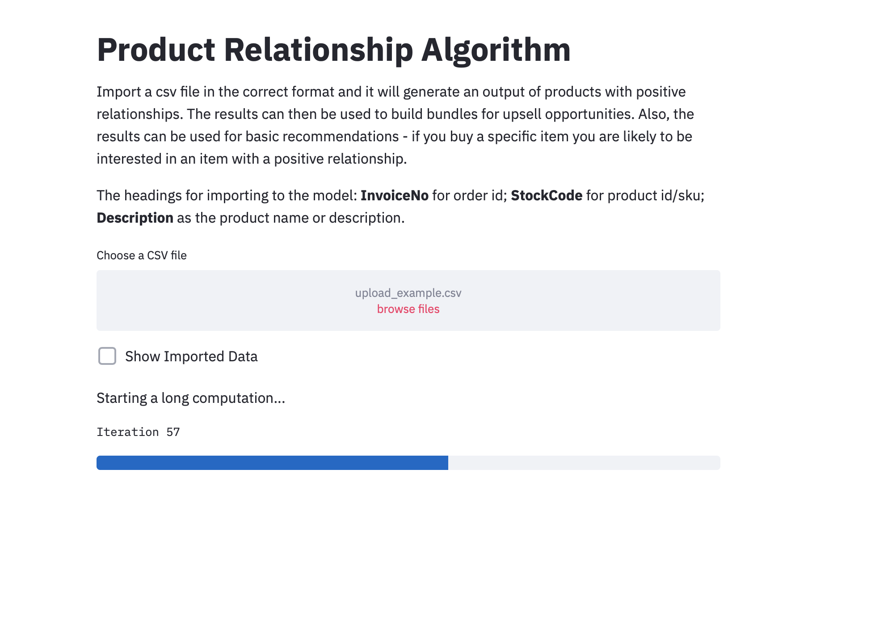

# Association-Rules
 Association rule mining, at a basic level, involves the use of machine learning models to analyze data for patterns, or co-occurrence, in a database. It identifies frequent if-then associations, which are called association rules.

## Built With

* [Python 3.7](https://www.python.org/downloads/release/python-370/) - More info

### Libraries to install 

```
pip install -r requirements.txt
```

or pip install 
```
pandas
numpy
streamlit
altair
pydec
```

## The App
This is a very basic app aimed at simplifying the management of running computations for a semi custom dataset (you can manage date parameters as well as product category and then make sure that the column names match the specifications). The point was to enable an analyst/ Data Scientist to simply upload the dataset and have the computations run automatically. Then Save the outputs in csv format. The task can also be completed by the merchandising team.

The concept can be taken further by including a DB connecter in the app with some custom parameters that can be passed through by the app. Such as dates between or product category etc. Then also potentially a action button like "Run Model" to start the computations. 

For now you can clone or download the reposit and simply run the streamlit app. I have also included an example dataset for importing. Have fun!!!

```
streamlit run app.py
```

## The Model

The code for the mode is in the **model.py** file. There you can adapt the output of the model and just copy into the app.py file. Or you could also adapt the code to replace the model in the app.py file with one simple function for pre-processing and then computation. 

## Data

* [Find some Data here](https://www.kaggle.com/) - Download the public dataset from here

### Deployment options

* Docker Setup. 
* Include the computations as a part of your ETL process (I use [KNIME](https://www.knime.com/)) - Include it as a step before writing the final customer lifetime table to your Data Warehouse.

## Author

* **Francois van Heerden** - *Experience* - [LinkedIn Profile](https://www.linkedin.com/in/francois-van-heerden-9589825a/)

## Acknowledgments

* Found inspiration from multiple fellow Data Scientists in the open source community
* But I would like to specifically highlight this post [Association Rule Mining via Apriori Algorithm in Python](https://stackabuse.com/association-rule-mining-via-apriori-algorithm-in-python/) 
